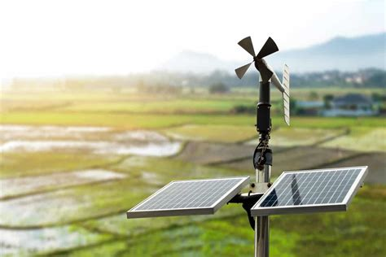

<!--
title: "Apresentação TCC"
author: Edimar Calebe Castanho
time: 14:39
-->

<body>
<br>
<center>
## Engenharia da Computação
## Universidade Positivo

<p>

**Autor**: Edimar Calebe Castanho
</p>
<p>
Curitiba - PR
</p>
<p>
2023
</p>
</center>

---

<br>
<br>
<center>
## Estudo das Técnicas de Compressão de Dados em Dispositivos IoT com Recursos Limitados
</center>

---

### 1: Introdução
A Internet das Coisas (IoT) tem revolucionado a forma como interagimos com o ambiente ao nosso redor, conectando dispositivos, sensores e sistemas a uma rede global, permitindo a coleta e troca de informações em tempo real.

---

### 1: Introdução
Esta evolução tecnológica tem encontrado aplicações em diversos setores, desde a automação residencial até a otimização de processos industriais e sistemas de saúde avançados.

No entanto, à medida que a IoT se expande, torna-se cada vez mais evidente a necessidade de enfrentar os desafios associados ao armazenamento e transmissão de dados em dispositivos com recursos limitados.

---

### 2: Problema

O advento da Internet das Coisas (IoT) revolucionou a forma como interagimos com o mundo ao nosso redor, conectando dispositivos, sensores e sistemas a uma rede global. No entanto, esse crescimento exponencial de dispositivos IoT trouxe consigo desafios significativos relacionados ao armazenamento e transmissão eficiente de dados. Muitos dispositivos IoT são caracterizados por recursos limitados, incluindo capacidade de armazenamento, capacidade de processamento e largura de banda de transmissão. Este cenário levanta a seguinte questão fundamental: como gerenciar eficazmente os dados gerados por dispositivos IoT em um ambiente de recursos limitados?

---

### 2: Problema
#### Dispositivos IoT

* Pouca memória
* Baixo processamento
* Duração alta da bateria

---

### 3: Justificativa

* Dispositivos IoT são amplamente utilizados em diversas aplicações, incluindo saúde, agricultura, manufatura e cidades inteligentes, e o volume de dados gerados por esses dispositivos continua a crescer exponencialmente.
* otimizar a utilização de recursos,
* economizar energia
* e melhorar a eficiência na transmissão de dados em redes com baixa taxa de transferência.

---

### 3: Justificativa

* Compactar dados obtidos

<center>

</center>

---

### 4: Objetivo Geral

**Objetivo Geral:**

* Investigar e analisar as técnicas de compressão de dados mais adequadas para dispositivos IoT com recursos limitados de armazenamento e transmissão.

* Compreender diferentes abordagens, vantagens, desvantagens e áreas de aplicação em contextos de IoT.

* Realizar estudos de caso práticos para avaliar a eficácia dessas técnicas em cenários reais de implementação de dispositivos IoT.

---

### 4: Objetivos Específicos

**Objetivos Específicos:**

* Realizar revisão abrangente da literatura existente sobre técnicas de compressão de dados, focando em estratégias para dispositivos IoT com recursos limitados.
* Comparar técnicas de compressão de dados sem perdas e com perdas, identificando suas características, vantagens e limitações.
* Implementar estudo de caso prático envolvendo coleta de dados por dispositivos IoT em ambiente controlado.
* Aplicar diversas técnicas de compressão de dados aos dados coletados e analisar os resultados em termos de economia de recursos, qualidade dos dados e eficiência da transmissão.

---

### 5: Revisão Bibliográfica

#### Internet das Coisas
- Conexão de dispositivos e objetos do cotidiano à internet.
- Aumento da quantidade de dados gerados.

---

### 5: Revisão Bibliográfica
#### Desafios da IoT
- Restrições dos objetos inteligentes: processamento, memória e energia.
- Segurança na IoT: vulnerabilidade a invasões.
- Heterogeneidade dos ambientes da IoT.

---

### 5: Revisão Bibliográfica
#### Compressão de Dados
- Redução do tamanho dos dados sem comprometer qualidade.
- Compressão com perdas e sem perdas.
- Aplicação na IoT para economia de recursos e melhoria da transmissão.

---

### 5: Revisão Bibliográfica
#### Aplicação de Compressão de Dados na IoT
- Redução de dados para economizar largura de banda.
- Importância em redes com baixa taxa de transferência.

---

### 5: Revisão Bibliográfica
#### Desafios na Escolha de Técnicas de Compressão de Dados
- Equilíbrio entre taxa de compressão e consumo de energia.
- Importância da escolha adequada para dispositivos IoT.

---

### 5: Revisão Bibliográfica
#### Trabalhos Relacionados
- Revisões sobre a compressão de dados na IoT.

---

### 6: Estudo de Caso
#### O Projeto
- Criação de uma ferramenta de compressão de dados em linguagem C.
- Compreensão dos algoritmos de compressão como Huffman, Deflate, RLE e LZW.

---

### 6: Estudo de Caso
#### Algoritmos

- Huffman Coding
- Deflate
- Run-length Encoding (RLE)
- Lempel-Ziv-Welch (LZW)

---

### 6: Estudo de Caso
#### Algoritmos
##### Huffman Coding

- Forças: Eficiente para compressão de texto e dados em geral, adaptativo à distribuição dos dados.
- Fraquezas: Pode não ser a melhor opção para dados altamente estruturados. Processamento de codificação e decodificação mais lento em comparação com métodos mais simples.
- Aplicações: Ampla utilização em compressão de texto e dados em geral.

---

### 6: Estudo de Caso
#### Algoritmos
##### Deflate

- Forças: Compressão versátil que combina LZ77 e codificação de Huffman. Equilibra a taxa de compressão e a velocidade eficazmente.
- Fraquezas: Pode não alcançar as maiores taxas de compressão em alguns casos.
- Aplicações: Comumente usado em arquivamento de arquivos (ZIP) e compressão de conteúdo da web (gzip).

---

### 6: Estudo de Caso
#### Algoritmos
##### Run-length Encoding(RLE)

- Forças: Eficaz para dados com longas sequências de valores repetidos, implementação simples.
- Fraquezas: Potencial de compressão limitado para dados complexos com pouca redundância.
- Aplicações: Adequado para gráficos simples, imagens binárias e cenários com dados altamente repetitivos.

---

### 6: Estudo de Caso
#### Algoritmos
##### Lempel-Ziv-Welch (LZW)

- Forças: Eficaz para texto e imagens simples, adequado para dados estruturados.
- Fraquezas: Pode não proporcionar a melhor compressão para dados complexos. Restrições de patente.
- Aplicações: GIF (Graphics Interchange Format), TIFF (Tagged Image File Format).

---

### 6: Estudo de Caso
#### Implementação
- Modularidade e eficiência do código para robustez da ferramenta.
- Uso de estruturas de dados e manipulação eficiente de informações.

---

### 6: Estudo de Caso
#### Compilação e Execução
- Testes abrangentes para validar a funcionalidade.
- Testes de desempenho e otimização em diferentes plataformas.

---

### 6: Estudo de Caso
#### Considerações Finais
- Experiência enriquecedora e desenvolvimento de uma ferramenta eficiente.

---

### 7: Desenvolvimento

#### Planejamento e Estruturação do Projeto
- Organização em diretórios para clara separação e manutenção.
- Enfoque na modularidade e organização do código-fonte.

---

### 7: Desenvolvimento
#### Implementação dos Algoritmos
- Implementação dedicada de cada algoritmo para modularidade e manutenção separada.

---

### 7: Desenvolvimento
#### Utilização de Ferramentas de Compilação
- Uso de Makefile para agilizar o processo de geração do executável final.
- gcc para x86
- gcc para ARMv6

---

### 8: Dados INMET

- Institudo Nacional de Meteorologia
- Utilizamos dados climáticos do ano de 2022 de Curitiba PR
- 688kB
- 8769 entradas de dados

---

### 8: Dados INMET
```csv
REGIAO:;S
UF:;PR
ESTACAO:;CURITIBA
CODIGO (WMO):;A807
LATITUDE:;-25,4486111
LONGITUDE:;-49,23055554
ALTITUDE:;922,91
DATA DE FUNDACAO:;28/01/03
Data;Hora UTC;PRECIPITAÇÃO TOTAL, HORÁRIO (mm);PRESSAO ATMOSFERICA AO NIVEL DA ESTACAO, HORARIA (mB);PRESSÃO ATMOSFERICA MAX.NA HORA ANT. (AUT) (mB);PRESSÃO ATMOSFERICA MIN. NA HORA ANT. (AUT) (mB);RADIACAO GLOBAL (Kj/m²);TEMPERATURA DO AR - BULBO SECO, HORARIA (°C);TEMPERATURA DO PONTO DE ORVALHO (°C);TEMPERATURA MÁXIMA NA HORA ANT. (AUT) (°C);TEMPERATURA MÍNIMA NA HORA ANT. (AUT) (°C);TEMPERATURA ORVALHO MAX. NA HORA ANT. (AUT) (°C);TEMPERATURA ORVALHO MIN. NA HORA ANT. (AUT) (°C);UMIDADE REL. MAX. NA HORA ANT. (AUT) (%);UMIDADE REL. MIN. NA HORA ANT. (AUT) (%);UMIDADE RELATIVA DO AR, HORARIA (%);VENTO, DIREÇÃO HORARIA (gr) (° (gr));VENTO, RAJADA MAXIMA (m/s);VENTO, VELOCIDADE HORARIA (m/s);
2022/01/01;0000 UTC;0;907,3;907,3;906,9;;17,6;;17,7;17,6;;;;;;88;1,9;,5;
2022/01/01;0100 UTC;0;906,7;907,3;906,7;;17,3;;17,6;17,2;;;;;;90;2,3;,3;
2022/01/01;0200 UTC;0;906;906,7;906;;17,3;;17,3;17;;;;;;64;1,6;,2;
2022/01/01;0300 UTC;0;905,9;906;905,7;;17,2;;17,3;16,9;;;;;;240;1,6;0;
2022/01/01;0400 UTC;0;905,5;905,9;905,5;;17;;17,2;17;;;;;;301;,8;0;
```
---

### 8: Testes e Resultados
#### Testes no Processador ARMv6

| Algoritmo | Operação      | Tempo (s) | Tamanho do arquivo (kB) |
|-----------|---------------|-----------|-------------------------|
| Huffman   | Compressão    | 0.669     | 176                     |
| Huffman   | Descompressão | 0.098     | 688                     |
| Deflate   | Compressão    | 0.699     | 176                     |
| Deflate   | Descompressão | 0.085     | 688                     |
| RLE       | Compressão    | 0.806     | 1232                    |
| RLE       | Descompressão | 0.086     | 680                     |
| LZW       | Compressão    | 40.834    | 228                     |
| LZW       | Descompressão | 0.146     | 688                     |

---

### 8: Teste e Resultados

#### Testes no Processador ARMv6
- Tempos de processamento mais longos em comparação com x86.
- Diferenças significativas nos tempos de compressão e descompressão.

---

### 8: Teste e Resultados
#### Testes no Processador x86

| Algoritmo | Operação      | Tempo (s) | Tamanho do arquivo (kB) |
|-----------|---------------|-----------|-------------------------|
| Huffman   | Compressão    | 0.161     | 176                     |
| Huffman   | Descompressão | 0.008     | 688                     |
| Deflate   | Compressão    | 0.161     | 176                     |
| Deflate   | Descompressão | 0.008     | 688                     |
| RLE       | Compressão    | 0.024     | 1232                    |
| RLE       | Descompressão | 0.005     | 680                     |
| LZW       | Compressão    | 3.515     | 228                     |
| LZW       | Descompressão | 0.011     | 688                     |

---

### 8: Teste e Resultados
#### Testes no Processador x86
- Tempos de processamento significativamente menores.
- Melhoria considerável de desempenho em relação ao ARMv6.

---

### 8: Teste e Resultados


#### Discussão dos Resultados
- Influência do hardware no desempenho da ferramenta.
- Importância da escolha do hardware para a eficiência dos algoritmos.

---

### 9: Conclusões

#### Análise dos Resultados
- Influência significativa do hardware no desempenho da ferramenta.
- Diferenças marcantes nos tempos de processamento entre os ambientes testados.

---

### 9: Conclusões
#### Considerações Finais
- Escolha do hardware é crucial para a otimização do desempenho.
- Investimentos em hardware mais robusto podem resultar em melhorias significativas.

---

### 9: Conclusões
#### Trabalhos Futuros
- Explorar estratégias de otimização para ambientes menos robustos.
- Testes em uma variedade maior de hardware.
- Investigar novos algoritmos de compressão e desenvolver versões específicas da ferramenta.

---

### 10: FIM?

**Obrigado!**

</body>
